# VaahanSafe Database Architecture — ERD (Migrations 0001–0003)

Authoritative Entity-Relationship Diagram for VaahanSafe's relational database running on **Cloudflare D1 (SQLite)**.

---

## High-Level Relational Diagram

```mermaid
erDiagram
    users ||--o{ auth_identities : "1:N (PHONE, GOOGLE)"
    users ||--o{ sessions : "1:N (token_hash)"
    users ||--o{ addresses : "1:N (SHIPPING, BILLING)"
    users ||--o{ vehicles : "1:N (owner)"
    
    vehicles ||--|| emergency_profiles : "1:1 (privacy controls)"
    emergency_profiles ||--o{ emergency_contacts : "1:N (priority 1..5)"
    
    qr_batches ||--o{ qr_stickers : "1:N (batch manufacturing)"
    qr_stickers ||--|| qr_activation_secrets : "1:1 (secret_hash only)"
    qr_stickers ||--o{ qr_assignments : "1:N (historical lifecycle)"
    vehicles ||--o{ qr_assignments : "1:N (assigned stickers)"
    users ||--o{ qr_assignments : "1:N (assigned users)"
    
    qr_stickers ||--o{ qr_status_history : "1:N (append-only audit)"
    qr_stickers ||--o{ qr_activation_attempts : "1:N (fraud telemetry)"
    qr_stickers ||--o{ qr_scan_events : "1:N (minimized analytics)"
    qr_stickers ||--o| qr_stickers : "replaced_by_qr_id (self-ref)"

    users {
        string id PK "usr_..."
        string primary_phone UK "Normalized E.164"
        string primary_email UK "Normalized lowercase"
        string full_name "Customer name"
        string onboarding_status "CHECK constraint"
        string status "ACTIVE | SUSPENDED | ..."
        string created_at "UTC ISO-8601"
        string updated_at "UTC ISO-8601"
    }

    auth_identities {
        string id PK "aid_..."
        string user_id FK "REFERENCES users(id)"
        string provider "PHONE | GOOGLE | EMAIL_OTP"
        string provider_subject "E.164 phone or OAuth sub"
        string normalized_identifier "Searchable index"
        string verified_at "UTC ISO-8601"
    }

    sessions {
        string id PK "ses_..."
        string user_id FK "REFERENCES users(id)"
        string token_hash UK "SHA-256 hash"
        string expires_at "UTC ISO-8601"
        string revoked_at "UTC ISO-8601"
    }

    addresses {
        string id PK "adr_..."
        string user_id FK "REFERENCES users(id)"
        string recipient_name "Recipient"
        string phone "Contact phone"
        string line1 "Address line 1"
        string city "City"
        string state "State"
        string postal_code "6-digit PIN"
        string type "SHIPPING | BILLING | PROFILE"
        integer is_default "0 or 1"
    }

    admin_users {
        string id PK "adm_..."
        string email UK "Admin email"
        string name "Full name"
        string role "SUPER_ADMIN | OPS_ADMIN | ..."
        string status "ACTIVE | ..."
    }

    vehicles {
        string id PK "veh_..."
        string user_id FK "REFERENCES users(id)"
        string registration_number "Formatted display"
        string registration_number_normalized "MH12AB1234"
        string vehicle_type "CAR | MOTORCYCLE | ..."
        string make "Hyundai"
        string model "Creta"
        string variant "SX(O)"
        integer year "2023"
        string color "White"
        string status "ACTIVE | ..."
    }

    emergency_profiles {
        string id PK "emp_..."
        string vehicle_id FK "REFERENCES vehicles(id) UNIQUE"
        string display_name "Owner display name"
        string blood_group "O+, B+, etc."
        string medical_notes "Safety notes"
        string public_vehicle_details "Vehicle public description"
        integer show_owner_name "0 or 1"
        integer show_blood_group "0 or 1"
        integer show_medical_notes "0 or 1"
        integer show_vehicle_details "0 or 1"
        string status "ACTIVE | PAUSED | DISABLED"
    }

    emergency_contacts {
        string id PK "emc_..."
        string emergency_profile_id FK "REFERENCES emergency_profiles(id)"
        string name "Contact name"
        string relationship_label "Spouse, Brother, etc."
        string phone "E.164"
        integer priority "1..5"
        integer is_enabled "0 or 1"
        integer allow_call "0 or 1"
        integer allow_message "0 or 1"
    }

    qr_batches {
        string id PK "qrb_..."
        string reference_code UK "BAT/VS/2026/001"
        integer quantity "Lot size > 0"
        string status "DRAFT | PRINTED | ..."
        string manufacturer_name "Vendor"
    }

    qr_stickers {
        string id PK "qr_..."
        string public_id UK "7F3K9021 (Indexed hot path)"
        string visible_code UK "VS-7F3K-9021"
        string batch_id FK "REFERENCES qr_batches(id)"
        string status "PRINTED | WITH_RETAILER | ACTIVATED | ..."
        string replaced_by_qr_id FK "Self-referencing replacement"
    }

    qr_activation_secrets {
        string id PK "qse_..."
        string qr_id FK "REFERENCES qr_stickers(id) UNIQUE"
        string secret_hash "Cryptographic hash only"
        string hash_version "v1"
        integer failed_attempts "Lockout counter"
        string locked_until "Lockout timer"
        string consumed_at "Single-use timestamp"
    }

    qr_assignments {
        string id PK "qra_..."
        string qr_id FK "REFERENCES qr_stickers(id)"
        string vehicle_id FK "REFERENCES vehicles(id)"
        string user_id FK "REFERENCES users(id)"
        string assignment_type "INITIAL | REPLACEMENT | TRANSFER"
        string assigned_at "UTC ISO-8601"
        string ended_at "NULL = ACTIVE ASSIGNMENT"
        string end_reason "REPLACED | ..."
    }

    qr_status_history {
        string id PK "qsh_..."
        string qr_id FK "REFERENCES qr_stickers(id)"
        string from_status "Previous status"
        string to_status "New status"
        string reason_code "Audit reason"
        string actor_type "SYSTEM | USER | ADMIN"
        string actor_id "Actor ID"
        string created_at "Append-only"
    }

    qr_activation_attempts {
        string id PK "qat_..."
        string qr_id FK "REFERENCES qr_stickers(id)"
        string outcome "SUCCESS | INVALID_SECRET | ..."
        string failure_reason_code "Error code"
        string request_fingerprint_hash "Privacy-minimized hash"
        string created_at "Append-only"
    }

    qr_scan_events {
        string id PK "qse_..."
        string qr_id FK "REFERENCES qr_stickers(id)"
        string scan_type "PUBLIC_RESOLVE | ..."
        string result "RESOLVED_ACTIVE | ..."
        string city "Coarse geolocation"
        string state "State"
        string created_at "Append-only"
    }
```

