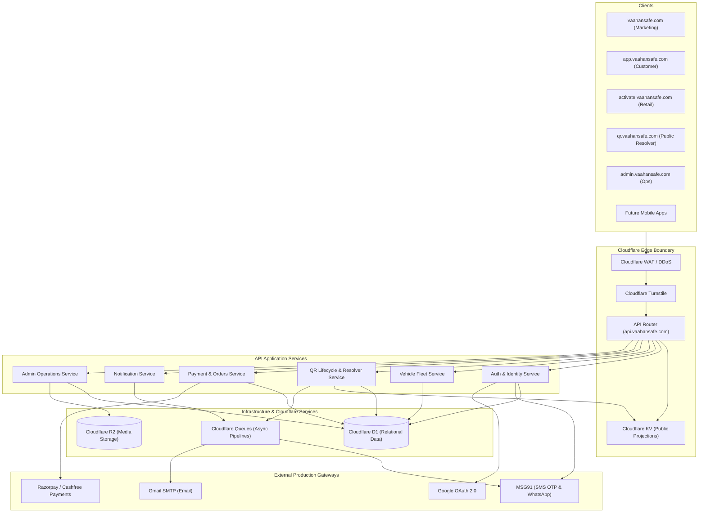
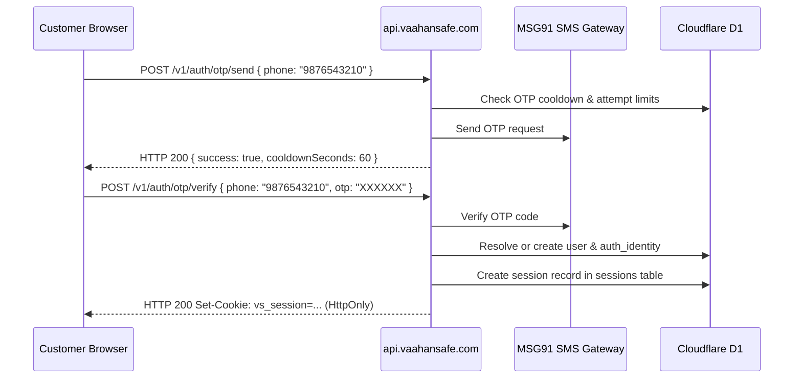
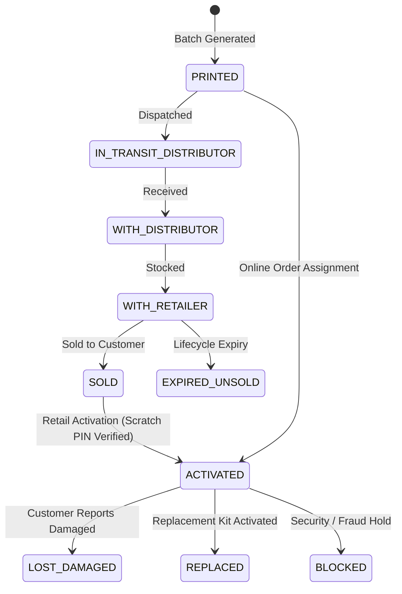
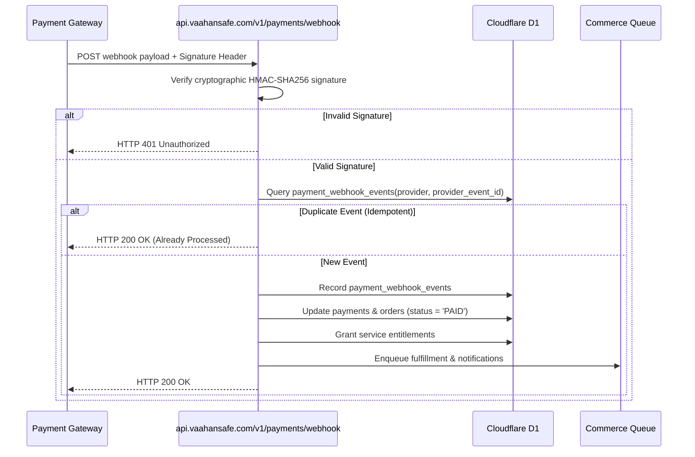

# VaahanSafe — API Architecture & Contracts Master Specification
**Target Platform:** `api.vaahansafe.com` (Port 3005)  
**Version:** 1.0.0 (API v1)  
**Author:** Principal Backend Architect, API Security Engineer, Cloudflare Platform Engineer  
**Classification:** Confidential — Core Platform Architecture Specification  

---

## 1. Executive Overview

VaahanSafe is India’s QR-based Vehicle Safety Identity Platform. It provides instant roadside emergency contact routing, vehicle incident dispatch, physical retail sticker activation, and permanent public emergency identity resolution.

The central API (`api.vaahansafe.com`) represents the authoritative security and domain boundary for:
- Authenticated customer operations (`app.vaahansafe.com`)
- Physical retail QR activation (`activate.vaahansafe.com`)
- High-uptime emergency QR resolution (`qr.vaahansafe.com`)
- Internal operations and fleet management (`admin.vaahansafe.com`)
- Payment gateway webhooks (Razorpay / Cashfree)
- Notification dispatch pipelines (MSG91 SMS/WhatsApp and SMTP)
- Future native mobile applications (iOS / Android)

The platform is designed Cloudflare-native, running entirely within Cloudflare Workers (edge compute), Cloudflare D1 (relational database), Cloudflare R2 (media object store), Cloudflare KV (edge cache), and Cloudflare Queues (asynchronous event pipeline).

---

## 2. API Goals and Non-Goals

### Goals
1. **Sub-50ms Public Resolution:** P95 latency under 50ms globally for emergency QR scans via edge KV caching and minimal D1 projection queries.
2. **Strict Privacy Isolation:** Zero personal phone numbers, addresses, or owner identities leaked to public browsers.
3. **Cryptographic Proof of Possession:** Physical QR activation requires constant-time verification of one-way salted PBKDF2 hashes; plaintext PINs are never stored or logged.
4. **Authoritative Financial & Entitlement Truth:** Absolute server authority for pricing and payments; browser redirects are never trusted for payment confirmation.
5. **Idempotent Mutations:** Critical write operations (activation, checkout, payment webhooks, replacements) enforce database-backed idempotency.
6. **Unified Observability:** Every request carries an `X-Request-ID` propagated through structured JSON logs, audit logs, and queue messages.

### Non-Goals
1. **No Client-Side Business Logic:** Frontend clients must never calculate final amounts, decide lifecycle transitions, or authorize service entitlements.
2. **No Monolithic Database Coupling:** Clients never query D1 directly or receive internal relational primary keys (`qr_id`, `user_id`, `billing_address_id`).
3. **No Direct HTTP Mandate within Monorepo:** Same-runtime edge operations may call shared domain services directly rather than incurring network serialization overhead.

---

## 3. System Context



---

## 4. API Architecture

`apps/api` is implemented as an edge-native modular monolith:
1. **Transport Layer (`apps/api/app/v1/*`):** Thin Next.js App Router handlers and Edge Workers responsible solely for HTTP parameter extraction, request-id propagation, header validation, and response formatting.
2. **Middleware Pipeline:** Composition of reusable edge filters (`requestIdMiddleware`, `rateLimitMiddleware`, `authMiddleware`, `validationMiddleware`, `idempotencyMiddleware`).
3. **Application Services (`@vaahansafe/*` packages):** Pure business logic isolated from HTTP mechanics, allowing reuse across edge workers and server actions.
4. **Domain Repositories (`@vaahansafe/database`):** Strongly typed parameterized Cloudflare D1 query abstractions.
5. **Provider Adapters (`@vaahansafe/payments`, `@vaahansafe/notifications`, `@vaahansafe/storage`):** Hexagonal port-adapter wrappers isolating external vendor SDKs.

---

## 5. Request Lifecycle

1. **Edge Ingress:** Request arrives at Cloudflare Edge. SSL termination, DDoS scrubbing, and Turnstile challenge validation (if applicable) execute at the edge.
2. **Correlation ID:** API assigns `req_` correlation ID if `X-Request-ID` is missing, attaching it to request context and outgoing response headers.
3. **Rate Limiting:** IP/User-scoped rate limits are evaluated against Cloudflare KV counters.
4. **Authentication & Session:** Evaluates `vs_session` or `vs_admin_session` cookie or `Authorization: Bearer <token>`. Resolves verified user and active roles.
5. **Input Validation:** Zod schema parses body, query, and path parameters, rejecting malformed requests immediately with machine-readable `VALIDATION_FAILED` (HTTP 400).
6. **Idempotency Guard:** For state-changing mutations (`POST`, `PATCH`), validates `Idempotency-Key` against `idempotency_records` table. If cached result exists, returns cached response immediately.
7. **Domain Execution:** Thin handler calls Application Service. D1 transaction runs with parameterized SQL.
8. **Asynchronous Side Effects:** Non-blocking telemetry or notifications are dispatched to Cloudflare Queues (`NOTIFICATION_QUEUE`, `ANALYTICS_QUEUE`).
9. **Projection & Sanitization:** Domain model is transformed through an Allowlist DTO Mapper to ensure no sensitive internal fields leak.
10. **Standard Envelope:** Success payload is wrapped in `{ data: ..., meta: { requestId } }` and returned with strict security and caching headers.

---

## 6. Trust Boundaries

| Boundary Level | Description | Invariant Controls |
| :--- | :--- | :--- |
| **Zone 0: Public Scanner** | Anonymous passerby scanning vehicle QR | Strict read-only projection; no PII; Turnstile protection on emergency alerts. |
| **Zone 1: Authenticated User** | Customer logged in with verified mobile phone | Access strictly scoped to owned vehicles, addresses, orders, and notifications. |
| **Zone 2: Retail Activation** | Authenticated user activating physical sticker | Requires cryptographic proof-of-possession (Scratch PIN); 5-attempt brute-force lockout. |
| **Zone 3: Provider Webhooks** | Inbound Cashfree/Razorpay callbacks | Raw body HMAC-SHA256 signature verification; database-backed deduplication. |
| **Zone 4: Operations Admin** | Internal operator on `admin.vaahansafe.com` | RBAC permission check; immutable audit log entry for every privileged mutation. |

---

## 7. API Versioning Strategy

* **Base URI:** `https://api.vaahansafe.com/v1/`
* **Versioning Rule:** Major URI versioning only (`/v1`, `/v2`). Minor/patch revisions are backward-compatible and do not change the URL path.
* **Non-Breaking Changes (Permitted in `/v1`):** Adding new optional fields to responses; adding new endpoints; adding optional query parameters.
* **Breaking Changes (Requiring `/v2`):** Removing endpoints; removing/renaming existing response fields; changing response field types; altering error code semantics.
* **Deprecation Policy:** Deprecated endpoints return HTTP response headers `Deprecation: @<timestamp>` and `Sunset: <date>`, documented in OpenAPI with 6 months minimum operational support.

---

## 8. Complete Endpoint Catalog

| Method | Endpoint | Auth | Permission | Idempotent | Cache Policy | Rate Limit | Description |
| :--- | :--- | :--- | :--- | :--- | :--- | :--- | :--- |
| `GET` | `/health` | None | Public | No | No-store | 1000/min | Service liveness and identity probe |
| `GET` | `/v1/auth/session` | Optional | Public | No | No-store | 120/min | Inspect active session state |
| `POST` | `/v1/auth/otp/send` | None | Public | No | No-store | 5/15min | Send MSG91 SMS OTP with cooldown |
| `POST` | `/v1/auth/otp/verify` | None | Public | No | No-store | 10/15min | Verify SMS OTP and establish session |
| `POST` | `/v1/auth/google/callback` | None | Public | No | No-store | 20/min | Exchange Google OAuth authorization code |
| `POST` | `/v1/auth/logout` | Session | User | Yes | No-store | 60/min | Terminate current session |
| `GET` | `/v1/me` | Session | User | No | Private, no-store | 120/min | Fetch authenticated user account profile |
| `PATCH` | `/v1/me` | Session | User | Yes | Private, no-store | 30/min | Update user profile details |
| `GET` | `/v1/me/addresses` | Session | User | No | Private, no-store | 60/min | List saved shipping addresses |
| `POST` | `/v1/me/addresses` | Session | User | Yes | Private, no-store | 30/min | Create shipping address |
| `DELETE` | `/v1/me/addresses/:id` | Session | User | Yes | Private, no-store | 30/min | Delete shipping address |
| `GET` | `/v1/vehicles` | Session | User | No | Private, no-store | 120/min | List vehicles owned by user |
| `POST` | `/v1/vehicles` | Session | User | Yes | Private, no-store | 30/min | Register vehicle with verified plate |
| `GET` | `/v1/vehicles/:id` | Session | Vehicle Owner | No | Private, no-store | 120/min | Fetch vehicle details |
| `PATCH` | `/v1/vehicles/:id` | Session | Vehicle Owner | Yes | Private, no-store | 30/min | Update vehicle metadata |
| `DELETE` | `/v1/vehicles/:id` | Session | Vehicle Owner | Yes | Private, no-store | 10/min | Deactivate/archive vehicle |
| `GET` | `/v1/vehicles/:id/emergency` | Session | Vehicle Owner | No | Private, no-store | 60/min | Get vehicle emergency configuration |
| `PATCH` | `/v1/vehicles/:id/emergency` | Session | Vehicle Owner | Yes | Private, no-store | 30/min | Update emergency contacts and notes |
| `GET` | `/v1/qr/resolve/:publicId` | None | Public | No | Public, 60s | 300/min | Edge-cached public QR projection |
| `POST` | `/v1/qr/scan` | None | Public | No | No-store | 600/min | Record scan event telemetry asynchronously |
| `POST` | `/v1/qr/activate` | Session | Verified User | Yes | No-store | 10/15min | Activate retail QR via scratch PIN proof |
| `POST` | `/v1/qr/:publicId/damaged` | Session | Vehicle Owner | Yes | No-store | 10/day | Report QR damaged or unreadable |
| `POST` | `/v1/emergency/alert` | None | Public | No | No-store | 3/15min | Dispatch roadside/parking emergency alert |
| `GET` | `/v1/emergency/profile/:publicId` | None | Public | No | Public, 30s | 120/min | Privacy-masked emergency profile |
| `GET` | `/v1/orders` | Session | User | No | Private, no-store | 60/min | List authenticated user orders |
| `POST` | `/v1/orders` | Session | User | Yes | Private, no-store | 30/min | Create order with authoritative pricing |
| `GET` | `/v1/orders/:orderId` | Session | Order Owner | No | Private, no-store | 60/min | Get order and fulfillment status |
| `POST` | `/v1/payments/create-order` | Session | User | Yes | Private, no-store | 30/min | Initialize payment gateway order |
| `GET` | `/v1/payments/verify/:orderId` | Session | Order Owner | No | No-store | 60/min | Authoritative D1 payment status check |
| `POST` | `/v1/payments/webhook` | Webhook Sig | Provider | Yes | No-store | 1200/min | Ingest signed Cashfree/Razorpay webhook |
| `GET` | `/v1/subscriptions/current` | Session | User | No | Private, no-store | 60/min | Get active subscription and entitlements |
| `GET` | `/v1/notifications` | Session | User | No | Private, no-store | 120/min | List in-app notifications |
| `POST` | `/v1/notifications/:id/read` | Session | Notification Owner| Yes | Private, no-store | 120/min | Mark notification as read |
| `POST` | `/v1/notifications/read-all` | Session | User | Yes | Private, no-store | 30/min | Mark all notifications as read |
| `POST` | `/v1/support/tickets` | Session | User | Yes | Private, no-store | 20/min | Create customer support ticket |
| `GET` | `/v1/support/tickets` | Session | User | No | Private, no-store | 60/min | List user support tickets |
| `POST` | `/v1/support/tickets/:id/messages`| Session | Ticket Owner | Yes | Private, no-store | 60/min | Add message to support ticket |
| `POST` | `/v1/media/uploads/authorize` | Session | User | Yes | Private, no-store | 30/min | Authorize R2 pre-signed upload |
| `POST` | `/v1/media/uploads/server` | Session | User | Yes | Private, no-store | 20/min | Small server-mediated R2 upload |
| `GET` | `/v1/admin/metrics` | Admin Session| `metrics.read` | No | Private, no-store | 60/min | Aggregated fleet and operations metrics |
| `GET` | `/v1/admin/qr/batches` | Admin Session| `inventory.read` | No | Private, no-store | 60/min | List manufacturing QR batches |
| `POST` | `/v1/admin/qr/batches` | Admin Session| `inventory.manage` | Yes | Private, no-store | 10/min | Generate new batch of QR stickers & PINs |
| `GET` | `/v1/admin/qr/inventory` | Admin Session| `inventory.read` | No | Private, no-store | 120/min | Paginated search of QR stickers |
| `GET` | `/v1/admin/audit-logs` | Admin Session| `audit.read` | No | Private, no-store | 60/min | Query immutable security audit log |

---

## 9. Authentication Architecture

VaahanSafe implements RFC 6265 compliant server-side session management:
1. **Primary Browser Channel:** `HttpOnly`, `SameSite=Lax`, `Path=/`, `Secure` (production) cookie `vs_session` for customer portal, and `vs_admin_session` for internal operations console.
2. **Mobile & Service Channel:** `Authorization: Bearer <session_token>` header for non-browser clients.
3. **Mandatory Mobile Verification Rule:** Accounts created via Google OAuth cannot access customer or vehicle APIs until they complete SMS OTP verification on MSG91, progressing from `PHONE_REQUIRED` to `ACTIVE`.



---

## 10. Session Architecture

```typescript
export interface SessionRecord {
  id: string;
  userId: string;
  tokenHash: string;
  role: "CUSTOMER" | "OPERATIONS" | "ADMIN" | "SUPER_ADMIN";
  ipAddress: string | null;
  userAgent: string | null;
  createdAt: string;
  expiresAt: string;
  revokedAt: string | null;
}
```

* **Storage:** D1 `sessions` table.
* **Token Entropy:** 32 cryptographically secure random bytes generated via `crypto.getRandomValues()`. Stored as SHA-256 hash.
* **Revocation:** Explicit revocation (`POST /v1/auth/logout`, `POST /v1/me/sessions/revoke-all`) sets `revokedAt = datetime('now')`.
* **Automatic Expiration:** Customer sessions valid for 30 days of inactivity; Admin sessions expire after 8 hours.

---

## 11. Authorization and RBAC Model

Authorization is evaluated using policy functions rather than raw string checks:

```typescript
export type Permission =
  | "vehicles.read"
  | "vehicles.manage"
  | "inventory.read"
  | "inventory.manage"
  | "orders.read"
  | "orders.refund"
  | "audit.read";

export async function canReadVehicle(actor: AuthActor, vehicleId: string, db: DatabaseClient): Promise<boolean> {
  if (actor.role === "SUPER_ADMIN" || actor.role === "ADMIN") return true;
  const vehicle = await db.queryFirst<{ user_id: string }>(
    "SELECT user_id FROM vehicles WHERE id = ? AND status = 'ACTIVE'",
    [vehicleId]
  );
  return vehicle?.user_id === actor.id;
}
```

---

## 12. User and Profile Contracts

* **Account Identity DTO:** Internal account identifier (`usr_...`), verified mobile, email, verification flags.
* **Private Profile DTO:** Name, preferences, registered address references.
* **Public Emergency Projection DTO:** Display name, blood group, medical emergency notes (only if explicitly enabled by the owner).

---

## 13. Vehicle Contracts

Vehicles are strictly validated using standard Indian registration conventions:
* Standard Format: `^[A-Z]{2}[0-9]{1,2}[A-Z]{0,3}[0-9]{4}$` (e.g., `MH12AB1234`, `DL3CAA1234`)
* Bharat Series: `^[0-9]{2}BH[0-9]{4}[A-Z]{1,2}$` (e.g., `22BH1234AA`)

Ownership enforcement prevents Insecure Direct Object References (IDOR): mutating any vehicle requires proving `vehicle.user_id === session.userId`.

---

## 14. QR Domain Lifecycle State Machine



### Invariants:
1. Transitions must execute through `transitionStickerState()`. Arbitrary SQL updates to `qr_stickers.status` are forbidden.
2. Every transition records an append-only entry in `qr_status_history`.
3. `ACTIVATED` status requires both valid vehicle assignment and active service entitlement.

---

## 15. QR Security Model

### The Three Independent Identifiers:
1. **Internal Primary Key (`id`):** `qr_01jk...` — Used internally in relational foreign keys. Never reaches public URLs or client DOMs.
2. **Public Identifier (`public_id`):** `7F3K9021` — 8-character Crockford Base32 string (excludes confusing characters `0, O, 1, I, L`). Used in public URLs (`https://qr.vaahansafe.com/7F3K9021`).
3. **Scratch Secret Proof (`scratch_secret`):** 8-character high-entropy PIN under the physical scratch-off panel. **Stored only as PBKDF2-HMAC-SHA256 salted hash** in `qr_activation_secrets`.

### Attack Defenses:
- **Lockout:** 5 failed attempts locks the QR for 30 minutes.
- **Timing Attacks:** Verified using constant-time byte comparison (`timingSafeEqualHex`).
- **Enumeration:** Crockford Base32 with 8 characters yields $32^8 \approx 1.1 \times 10^{12}$ combinations.

---

## 16. Public QR Resolution Architecture

```text
Passerby Scans QR (https://qr.vaahansafe.com/7F3K9021)
       ↓
Cloudflare Edge Worker
       ↓
Validate Format (Crockford Base32)
       ↓
Cloudflare KV Cache Lookup: key = "qr:proj:7F3K9021"
       ├── CACHE HIT (TTL 60s) ──→ Return Public Projection (<15ms)
       └── CACHE MISS
             ↓
       D1 Hot-Path Indexed Query (Single SELECT on indexed public_id)
             ↓
       Build Public Emergency Projection Allowlist
             ↓
       Write to KV Cache (TTL 60s)
             ↓
       Return Public Projection (~45ms)
             ↓
       (Non-blocking) Dispatch Scan Event to Cloudflare Queue
```

---

## 17. Scan Analytics Architecture

* **Non-Blocking Telemetry:** Analytics logging must never delay or fail public emergency resolution.
* **Asynchronous Queue:** `recordPublicScanEventSafely` sends an event to Cloudflare Queue `ANALYTICS_QUEUE`.
* **Privacy Preservation:** Client IP addresses are hashed using daily rotating salts before insertion; raw IPs are never persisted.
* **Crawler Filtering:** Requests with `Purpose: prefetch`, bot user-agents (`Googlebot`, `WhatsApp/Preview`), or rapid duplicate refreshes within 10 seconds are flagged or discarded.

---

## 18. Activation Architecture

Activation is an atomic, idempotent mutation:

```typescript
// POST /v1/qr/activate
{
  "publicId": "7F3K9021",
  "scratchCode": "J8N2K9L4",
  "vehicleId": "veh_01jk...",
  "userId": "usr_01jk..."
}
```

### Atomic Execution Steps:
1. Verify `Idempotency-Key` in D1.
2. Select sticker and activation secret record by `public_id`.
3. Assert sticker status is not already `ACTIVATED`, `BLOCKED`, or `LOST_DAMAGED`.
4. Assert `locked_until` is null or in the past.
5. Compute PBKDF2 hash of `scratchCode` with stored salt; verify in constant time.
6. Verify authenticated user owns `vehicleId`.
7. Execute D1 batch transaction:
   - Update `qr_stickers SET status = 'ACTIVATED', activated_at = datetime('now')`.
   - Update `qr_activation_secrets SET consumed_at = datetime('now')`.
   - Insert `qr_assignments (id, qr_id, vehicle_id, user_id, assignment_type = 'INITIAL')`.
   - Insert `service_entitlements` for capabilities (`DIGITAL_QR_ACCESS`, `SAFETY_VIEW_ACTIVE`, `EMERGENCY_ROUTING`).
   - Insert `qr_status_history`.
8. Invalidate edge KV cache for `qr:proj:7F3K9021`.
9. Enqueue in-app and WhatsApp activation confirmations.

---

## 19. Emergency-Profile Privacy Model

The public emergency projection enforces strict allowlist filtering:

```typescript
export interface PublicEmergencyProfileDTO {
  qrPublicId: string;
  status: "ACTIVE";
  vehicleDisplay: string;        // e.g. "Tata Nexon EV • Dark Blue"
  vehicleType: "CAR" | "MOTORCYCLE" | "COMMERCIAL";
  approvedOwnerDisplayName?: string;
  bloodGroup?: string;           // Only if show_blood_group = 1
  approvedSafetyNotes?: string;  // Only if show_medical_notes = 1
  approvedEmergencyContacts: Array<{
    name: string;
    relationship: string;
    isPriority: boolean;
    // Phone numbers are NEVER exposed directly in the DTO
  }>;
}
```

---

## 20. Order Architecture

Orders follow a strict state machine: `DRAFT` $\rightarrow$ `PENDING_PAYMENT` $\rightarrow$ `PAID` $\rightarrow$ `FULFILMENT_PENDING` $\rightarrow$ `FULFILLED` (or `CANCELLED` / `REFUNDED`).

Internal order state transitions are server-only. Clients cannot submit arbitrary order statuses.

---

## 21. Checkout Architecture

**Rule 08 (Never Trust Client Pricing):**
- Client requests product purchase via `productId`.
- Server queries D1 `products` table for authoritative `price_minor` and `currency`.
- Server calculates taxes, discounts, and shipping.
- Authoritative order is created in D1 before communicating with the payment gateway.

---

## 22. Payment Architecture

Payment providers are abstracted behind a unified interface:

```typescript
export interface PaymentGateway {
  createPaymentOrder(input: PaymentOrderInput): Promise<PaymentOrderSession>;
  verifyPaymentStatus(orderId: string): Promise<PaymentVerificationResult>;
}
```

Razorpay is the primary active provider; Cashfree remains supported for legacy reconciliation.

---

## 23. Webhook Architecture (Razorpay & Cashfree)



---

## 24. Subscription Architecture

* **Plan:** Catalog definition of service limits (vehicle limit, emergency contact limit, history retention).
* **Subscription:** Account binding with validity dates (`starts_at`, `expires_at`, `grace_period_until`).
* **State Values:** `ACTIVE`, `TRIAL`, `PAST_DUE`, `CANCELLED`, `EXPIRED`.

---

## 25. Entitlement System

Entitlements decouple payment receipt from feature gates:

```typescript
export async function canUseQrService(userId: string, vehicleId: string, db: DatabaseClient): Promise<boolean> {
  const row = await db.queryFirst<{ status: string }>(
    `SELECT status FROM service_entitlements
     WHERE user_id = ? AND vehicle_id = ? AND capability = 'SAFETY_VIEW_ACTIVE' AND status = 'ENABLED'`,
    [userId, vehicleId]
  );
  return Boolean(row);
}
```

---

## 26. Notification Architecture

All outward messages (SMS, WhatsApp, transactional email) pass through Cloudflare Queues:

```text
Domain Event (e.g. EMERGENCY_ALERT)
       ↓
Cloudflare Queue: NOTIFICATION_QUEUE
       ↓
Worker Consumer (idempotent dedupe via notification_intents)
       ├── In-App Notification (D1 notifications table)
       ├── WhatsApp Alert (MSG91 API)
       └── Email Delivery (Gmail SMTP)
```

---

## 27. Support Architecture

* Customers can open support tickets categorized by `QR_DEFECT`, `SHIPPING_DELAY`, `BILLING`, or `GENERAL`.
* Attachments are stored exclusively in Cloudflare R2 via pre-signed direct upload URLs.

---

## 28. Admin Architecture & RBAC

All `/v1/admin/*` endpoints require an active `vs_admin_session` cookie or bearer token with verified admin roles:
* `SUPER_ADMIN`: Full platform configuration and overrides.
* `OPERATIONS_ADMIN`: Batch generation, inventory allocation, and fulfillment oversight.
* `SUPPORT_AGENT`: Ticket management and customer assistance.
* `AUDITOR`: Read-only access to audit logs and metrics.

---

## 29. Standard API Request and Response Envelopes

### Success Envelope
```json
{
  "data": {},
  "meta": {
    "requestId": "req_01jk98a47bc23de9",
    "timestamp": "2026-10-03T18:00:00.000Z"
  }
}
```

### Paginated Collection Envelope
```json
{
  "data": [],
  "meta": {
    "requestId": "req_01jk98a47bc23de9",
    "timestamp": "2026-10-03T18:00:00.000Z",
    "pagination": {
      "page": 1,
      "limit": 20,
      "total": 142,
      "totalPages": 8,
      "hasMore": true
    }
  }
}
```

### Error Envelope
```json
{
  "error": {
    "code": "QR_SECRET_INVALID",
    "message": "The scratch verification code is incorrect. Please verify the code on your physical sticker.",
    "details": null
  },
  "meta": {
    "requestId": "req_01jk98a47bc23de9",
    "timestamp": "2026-10-03T18:00:00.000Z"
  }
}
```

---

## 30. Error Taxonomy

| Error Code | HTTP Status | Category | Description |
| :--- | :--- | :--- | :--- |
| `AUTH_REQUIRED` | 401 | Authentication | Request requires an active session or token |
| `AUTH_SESSION_EXPIRED` | 401 | Authentication | Session token has expired |
| `PERMISSION_DENIED` | 403 | Authorization | Actor lacks required role or resource ownership |
| `VALIDATION_FAILED` | 400 | Validation | Request body or parameters failed schema validation |
| `IDEMPOTENCY_CONFLICT` | 409 | Mutation | Same idempotency key used with mismatched payload |
| `RATE_LIMIT_EXCEEDED` | 429 | Abuse Control | Request threshold exceeded |
| `VEHICLE_NOT_FOUND` | 404 | Vehicle | Vehicle not found or inactive |
| `QR_NOT_FOUND` | 404 | QR Core | QR public identifier not recognized |
| `QR_ALREADY_ACTIVATED` | 409 | Activation | QR sticker has already been claimed |
| `QR_SECRET_INVALID` | 400 | Activation | Scratch PIN does not match one-way hash |
| `QR_LOCKED` | 429 | Security | QR locked due to excessive invalid attempts |
| `ORDER_NOT_FOUND` | 404 | Commerce | Order identifier does not exist |
| `PAYMENT_FAILED` | 402 | Payments | Payment verification rejected by gateway |
| `SYSTEM_UNAVAILABLE` | 503 | Platform | Upstream service or database temporarily unavailable |

---

## 31. Validation Architecture

All input schemas are written in Zod and stored in `@vaahansafe/validation`. Handlers parse inputs before executing business logic, guaranteeing type safety at runtime.

---

## 32. Idempotency Architecture

Mutation endpoints accept the `Idempotency-Key` header.
* **Storage Table:** `idempotency_records (id, key, actor_id, request_hash, response_status, response_body, created_at, expires_at)`.
* **Behavior:** If the key matches an existing record with the same `request_hash`, the cached response is returned with `X-Cache-Lookup: HIT`. If the payload differs, it returns `IDEMPOTENCY_CONFLICT` (HTTP 409).

---

## 33. Pagination and Filtering

List endpoints enforce maximum limits:
* Default page size: `20`
* Maximum page size: `100`
* Sorting parameters are strictly allowlisted (e.g. `sort=createdAt:desc`). Arbitrary SQL fragments are rejected.

---

## 34. Rate Limiting Strategy

| Route Scope | Limit | Window | Tracking Key |
| :--- | :--- | :--- | :--- |
| Public QR Resolve | 300 req | 1 min | Client IP Hash |
| Emergency Alert Dispatch | 3 req | 15 min | Vehicle ID + Client IP |
| OTP Send | 5 req | 15 min | Normalized Mobile Number |
| OTP Verify | 10 req | 15 min | Normalized Mobile Number |
| QR Secret Verification | 5 req | 30 min | QR Sticker ID |
| Authenticated Read APIs | 120 req | 1 min | User Session ID |
| Admin APIs | 120 req | 1 min | Admin Session ID |

---

## 35. Cache Policy

* `PUBLIC_CACHEABLE`: Public QR safe projections (`Cache-Control: public, max-age=60, s-maxage=120, stale-while-revalidate=300`).
* `PRIVATE_NO_STORE`: Authenticated user, profile, vehicle, and payment endpoints (`Cache-Control: private, no-cache, no-store, must-revalidate`).
* `NEVER_CACHE`: Secret verification, OTP endpoints, activation, and webhooks.

---

## 36. Cloudflare R2 Media Architecture

Large assets (vehicle photos, insurance documents, support attachments) are uploaded directly to R2 buckets (`PUBLIC_STORAGE`, `PRIVATE_STORAGE`):
1. Client calls `POST /v1/media/uploads/authorize` with filename, MIME type, and size.
2. Server validates MIME magic bytes and issues a scoped, single-use presigned URL or upload ticket.
3. Client uploads binary payload directly to R2.
4. Client calls `POST /v1/media/uploads/:uploadId/complete`. Server verifies object metadata and records asset in D1 `media_assets`.

---

## 37. Queue Contracts

```typescript
export interface QueueMessageEnvelope<T = unknown> {
  version: 1;
  eventId: string;
  eventType: string;
  requestId: string;
  occurredAt: string;
  payload: T;
}
```

Consumers are idempotent, checking unique `eventId` or `dedupe_key` before executing mutations.

---

## 38. Domain Events

* `qr.printed`
* `qr.activated`
* `qr.scanned`
* `qr.replaced`
* `emergency.triggered`
* `order.created`
* `payment.captured`
* `subscription.renewed`
* `support.ticket_opened`

---

## 39. Database Design & D1 Migrations

The database consists of 16 structured D1 SQL migrations in `infrastructure/cloudflare/d1/migrations/`:
* `0001_identity.sql`: `users`, `auth_identities`, `sessions`
* `0002_vehicle_emergency.sql`: `vehicles`, `emergency_contacts`, `emergency_profiles`
* `0003_qr_inventory.sql`: `qr_batches`, `qr_stickers`, `qr_activation_secrets`, `qr_assignments`, `qr_scan_events`, `qr_status_history`
* `0004_media_assets.sql`: `media_assets`
* `0005_commerce_subscriptions.sql`: `products`, `orders`, `order_items`, `payments`, `payment_webhook_events`, `subscriptions`
* `0006_notifications.sql`: `notifications`, `notification_intents`, `notification_preferences`
* `0007_fulfilment_shipping_replacement.sql`: `shipments`, `qr_replacements`
* `0008_service_entitlements_and_idempotency.sql`: `service_entitlements`, `idempotency_records`

---

## 40. Audit Architecture

All administrative mutations, activation events, and payment state changes write immutable audit records to `audit_logs`:
* Captured fields: `id`, `actor_id`, `actor_type`, `action`, `resource_type`, `resource_id`, `request_id`, `ip_address`, `before_state_json`, `after_state_json`, `created_at`.
* Sensitive credentials (tokens, secrets) are redacted before serialization.

---

## 41. Observability

* **Structured JSON Logging:** Emits standardized log entries containing `timestamp`, `level`, `requestId`, `route`, `status`, `durationMs`.
* **Redaction Policy:** Headers `Authorization`, `Cookie`, `X-Webhook-Signature`, and fields `otp`, `scratchCode`, `secret_hash` are masked automatically.

---

## 42. Security Threat Model (STRIDE)

| Threat | Attack Vector | Impact | Mitigation |
| :--- | :--- | :--- | :--- |
| **Spoofing** | Forged payment webhook | Fake order completion | HMAC-SHA256 signature verification with secret key. |
| **Tampering** | Modifying vehicle ID in URL (IDOR) | Unauthorized vehicle update | Explicit `canReadVehicle()` / ownership policy checks. |
| **Repudiation** | Operator denies sticker deactivation | Unaccountable admin action | Immutable `audit_logs` record with actor ID and before/after snapshot. |
| **Information Disclosure** | Scraping public QR endpoints | Leaking driver phone & address | Allowlist DTO projection; private fields omitted from query. |
| **Denial of Service** | Alert storming vehicle owner | SMS / notification flood | Sliding-window cooldown (15 min) & Turnstile bot verification. |
| **Elevation of Privilege** | Normal user calling `/v1/admin/*` | System compromise | Strict RBAC session guard and role verification. |

---

## 43. OpenAPI 3.1 Architecture

OpenAPI specification is generated from the shared TypeScript and Zod route schemas, exposing interactive documentation at `https://api.vaahansafe.com/docs` (restricted in production).

---

## 44. API Documentation Strategy

Developer portal at `https://vaahansafe.com/developers` contains realistic payloads, sandbox credentials, signature generation code samples in TypeScript/Python/cURL, and error recovery walkthroughs.

---

## 45. Complete Monorepo and File Structure

```text
apps/api/
├── app/
│   ├── health/
│   │   └── route.ts
│   ├── v1/
│   │   ├── _db.ts
│   │   ├── admin/
│   │   │   ├── metrics/route.ts
│   │   │   └── qr/
│   │   │       ├── batches/route.ts
│   │   │       └── inventory/route.ts
│   │   ├── emergency/
│   │   │   ├── alert/route.ts
│   │   │   └── profile/[publicId]/route.ts
│   │   ├── media/
│   │   │   ├── [assetId]/route.ts
│   │   │   └── uploads/
│   │   │       ├── authorize/route.ts
│   │   │       └── server/route.ts
│   │   ├── payments/
│   │   │   ├── create-order/route.ts
│   │   │   ├── verify/[orderId]/route.ts
│   │   │   └── webhook/route.ts
│   │   └── qr/
│   │       ├── activate/route.ts
│   │       ├── resolve/[publicId]/route.ts
│   │       └── scan/route.ts
│   ├── layout.tsx
│   ├── page.tsx
│   └── robots.ts
├── package.json
├── tsconfig.json
└── wrangler.jsonc
```

---

## 46. Environment Strategy

* **Local (`.dev.vars`):** Local D1 bindings, Mock/Test Razorpay & MSG91 keys.
* **Staging (`wrangler.staging.jsonc`):** Live Cloudflare staging D1 & R2 with sandbox credentials.
* **Production (`wrangler.jsonc`):** Production D1 cluster, production R2 storage, production Razorpay and MSG91 channels with strict IP allowlisting.

---

## 47. CI/CD API Quality Gates

Every deployment must pass 4 gates:
1. `npm run typecheck` (strict TypeScript validation)
2. `npm run lint` (ESLint zero warnings)
3. `npx vitest run tests/api-*.test.ts` (100% test pass rate)
4. D1 Migration Dry Run (`wrangler d1 migrations apply DB --dry-run`)

---

## 48. Testing Strategy

1. **Unit Tests:** Schema validation, secret hashing, entitlement calculations.
2. **Integration Tests:** D1 repository queries, R2 uploads, signature verifiers.
3. **Security Tests:** IDOR attacks, scratch PIN brute force, invalid signatures, malformed payloads.
4. **Concurrency Tests:** Race conditions on simultaneous QR activations and duplicate payment webhooks.

---

## 49. Failure-Mode Design

| Component Outage | Fallback Behavior |
| :--- | :--- |
| **Cloudflare KV Unavailable** | Degrades gracefully; falls back directly to D1 hot-path query. |
| **MSG91 Gateway Unavailable** | Queues notification in `NOTIFICATION_QUEUE` with exponential backoff (up to 5 retries). |
| **Payment Gateway Webhook Timeout** | Gateway retries webhook delivery; database idempotency prevents duplicate processing. |
| **Cloudflare D1 Read Failure** | Returns calm HTTP 500/503 service error; **never falls back to dummy or mock data**. |

---

## 50. Implementation Phases

* **Phase 1: Foundation (Completed)** — Health probe, routing, D1 bindings, standard envelopes.
* **Phase 2: QR Core & Resolver (Completed)** — Public resolution, scan telemetry, retail scratch PIN activation.
* **Phase 3: Emergency Alerts (Completed)** — Passerby emergency dispatch, sliding cooldown, masked profiles.
* **Phase 4: Payments & Webhooks (Completed)** — Server-side order creation, Razorpay webhook ingest, verification.
* **Phase 5: Operations & Fleet Admin (Completed)** — Batches generation, inventory lookup, metrics.
* **Phase 6: Admin Frontend Integration (Next Phase)** — Hooking up `apps/admin` UI to `apps/api`.

---

## 51. Production-Readiness Checklist

- [x] Cloudflare D1 migrations applied and indexed.
- [x] Secret hash verification implemented with constant-time comparison.
- [x] Zero client amount trust in payment creation.
- [x] Webhook signature verification enforced.
- [x] Public QR projection allowlist verified to omit PII.
- [x] Structured JSON logging with header redaction.
- [x] 100% automated test suite passing across all API modules.
